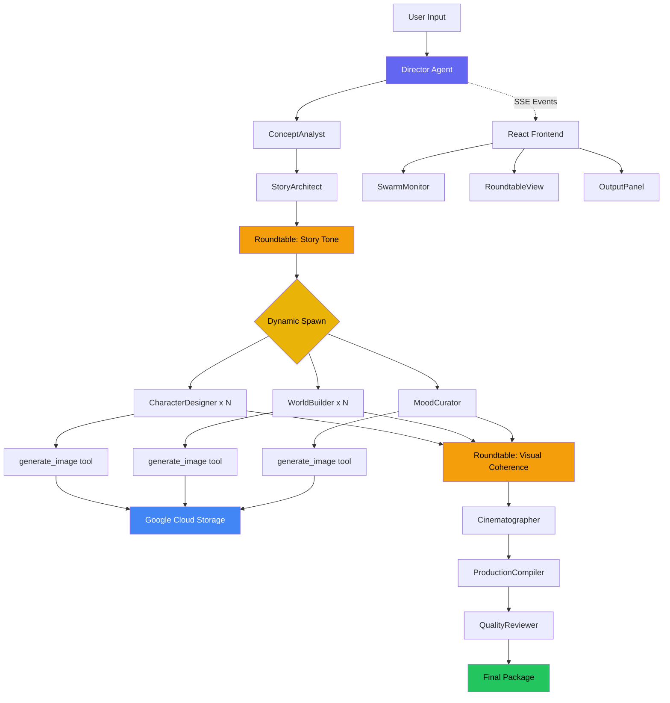

# FilmSwarm - AI Film Pre-Production Swarm

> **Gemini Live Agent Challenge** - Creative Storyteller Category

FilmSwarm is a multi-agent AI system that generates complete film pre-production packages. A Director agent dynamically spawns specialized agents based on your story content, agents deliberate visibly through roundtable discussions, and ~13 concept art images are generated in real-time.

**Live Demo:** [filmswarm-591339435677.us-central1.run.app](https://filmswarm-591339435677.us-central1.run.app)

## How It Works

1. **You provide a film concept** (one sentence to a paragraph)
2. **The Director agent analyzes it** and spawns specialized agents
3. **Agents deliberate visibly** - you watch roundtable discussions in real-time
4. **Images are generated** as agents work on characters, locations, and mood
5. **A complete pre-production package** is compiled and quality-reviewed

## Architecture



### Agent Pipeline

| Phase | Agent | Description |
|-------|-------|-------------|
| 1. Concept | ConceptAnalyst | Parses concept into structured creative brief |
| 2. Story | StoryArchitect | Creates full story structure (characters, locations, scenes) |
| 2b. Deliberation | Roundtable | Director + StoryArchitect discuss tone and direction |
| 3. Visual Production | CharacterDesigner x N | One per character - portraits + design sheets |
| 3. Visual Production | WorldBuilder x N | One per location - establishing shots + detail shots |
| 3. Visual Production | MoodCurator | Color palette, mood board, visual style guide |
| 3b. Deliberation | Roundtable | Visual coherence check across all designs |
| 4. Cinematography | Cinematographer | Shot list + storyboard frames |
| 5. Compilation | ProductionCompiler | Assembles everything into final package |
| 5. Quality | QualityReviewer | Scores on 5 dimensions, pass/fail |

### Three Interaction Modes

- **Auto-pilot**: Agents run autonomously. Watch the stream.
- **Collaborate**: Pipeline pauses at checkpoints for your review and guidance.
- **Direct**: Talk to individual agents (coming soon).

### Key Differentiators

- **Dynamic agent spawning**: Agents are created at runtime based on story content (3 characters = 3 CharacterDesigner agents)
- **Visible deliberation**: Roundtable discussions where agents debate creative decisions in real-time
- **Interleaved text + images**: ~13 concept art images generated alongside rich text descriptions
- **SSE streaming**: Every event streamed to the frontend for live visualization

## Tech Stack

| Layer | Technology |
|-------|-----------|
| Agent Orchestration | `@google/adk` (TypeScript) |
| LLM (Reasoning) | `gemini-3.1-pro-preview` |
| LLM (Image Gen) | `gemini-3.1-flash-image-preview` |
| Backend | Express + TypeScript |
| Frontend | React + Vite + Tailwind CSS + Zustand |
| Database | Cloud Firestore |
| Image Storage | Google Cloud Storage |
| Deployment | Cloud Run (server) + Firebase Hosting (client) |
| CI/CD | Cloud Build |

## Google Cloud Services Used

- **Cloud Run** - Hosts the Express server
- **Cloud Firestore** - Project and session persistence
- **Cloud Storage** - Stores generated concept art images
- **Secret Manager** - API key storage
- **Artifact Registry** - Docker image hosting
- **Cloud Build** - CI/CD pipeline
- **Firebase Hosting** - Serves the React SPA

## Setup

### Prerequisites

- Node.js 20+
- Google Cloud project with billing enabled
- Firebase project
- Gemini API key

### Local Development

```bash
# Clone
git clone https://github.com/InventorCoin/filmswarm.git
cd filmswarm

# Server
cd server
cp .env.example .env  # Fill in your keys
npm install
npm run dev

# Client (new terminal)
cd client
npm install
npm run dev
```

### Environment Variables

```
GOOGLE_API_KEY=your-gemini-api-key
GOOGLE_GENAI_API_KEY=your-gemini-api-key  # Required by @google/adk
GOOGLE_CLOUD_PROJECT=your-gcp-project
GCS_BUCKET=your-gcs-bucket
PORT=3001
NODE_ENV=development
CLIENT_URL=http://localhost:5173
```

### Deploy

```bash
# Build and push Docker image
docker build --platform=linux/amd64 -t us-central1-docker.pkg.dev/PROJECT/filmswarm/server:latest .
docker push us-central1-docker.pkg.dev/PROJECT/filmswarm/server:latest

# Deploy to Cloud Run
gcloud run deploy filmswarm \
  --image us-central1-docker.pkg.dev/PROJECT/filmswarm/server:latest \
  --region us-central1 --allow-unauthenticated

# Deploy client to Firebase Hosting
cd client && npm run build
firebase deploy --only hosting
```

## SSE Event Types

The server streams these events via Server-Sent Events:

| Event | Description |
|-------|-------------|
| `agent_spawned` | New agent created dynamically |
| `agent_started` | Agent begins working |
| `agent_thinking` | Agent's text output (streamed) |
| `agent_completed` | Agent finished |
| `roundtable_started` | Multi-agent deliberation begins |
| `roundtable_message` | Agent speaks in roundtable |
| `roundtable_concluded` | Decision reached |
| `checkpoint_reached` | Pipeline paused for user input |
| `image_generated` | Concept art created and uploaded |
| `tool_call` | Agent invoked a tool |
| `pipeline_completed` | All done |

## Project Structure

```
filmswarm/
  server/
    src/
      agents/       # 9 specialized agents + roundtable
      tools/        # generate_image, store_artifact
      pipeline/     # event bus, checkpoint, runner
      routes/       # API endpoints (project, stream, interact)
      config/       # gemini, firebase, env
  client/
    src/
      components/   # SwarmMonitor, RoundtableView, OutputPanel, etc.
      hooks/        # useSSE
      stores/       # Zustand state management
  Dockerfile
  cloudbuild.yaml
  firebase.json
```

## License

MIT
